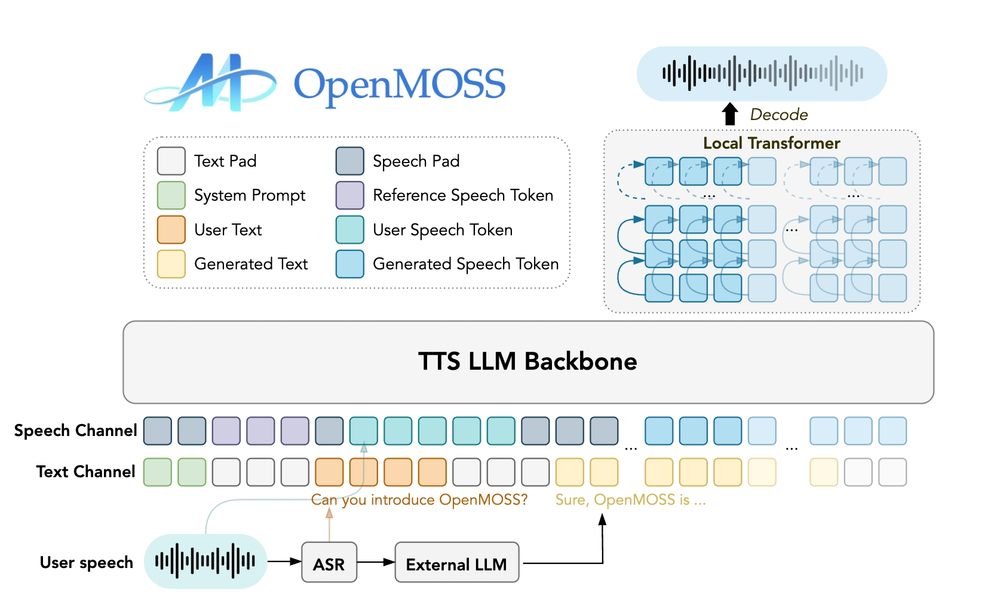

# MOSS-TTS-Realtime
**MOSS-TTS-Realtime** is a context-aware, multi-turn streaming TTS foundation model designed for real-time voice agents. 
It natively supports spoken interactions by conditioning speech generation on both textual and acoustic history from previous dialogue turns. 
By tightly integrating multi-turn context modeling with low-latency streaming synthesis, MOSS-TTS-Realtime generates incremental audio responses that preserve voice consistency and discourse coherence, enabling excellent natural and human-like conversational speech.

## 1. Overview

### 1.1 TTS Family Positioning

**MOSS-TTS-Realtime** is a high-performance, real-time speech synthesis model within the broader MOSS TTS Family. It is designed for interactive voice agents that require low-latency, continuous speech generation across multi-turn conversations. Unlike conventional streaming TTS systems that synthesize each response in isolation, MOSS-TTS-Realtime natively models dialogue context by conditioning speech generation on both textual and acoustic information from previous turns. By tightly integrating multi-turn context awareness with incremental streaming synthesis, it produces natural, coherent, and voice-consistent audio responses, enabling fluid and human-like spoken interactions for real-time applications.

**Key Capabilities**
* **Context-Aware & Expressive Speech Generation**: Generates expressive and coherent speech by modeling both textual and acoustic context across multiple dialogue turns.

* **High-Fidelity Voice Cloning with Multi-Turn Consistency**: Achieves exceptionally high voice similarity while maintaining strong speaker identity consistency across multiple dialogue turns.

* **Long-Context**: Supports long-range context with a maximum context length of 32K (about 40 minutes), enabling stable and consistent speech generation in extended conversations.

* **Highly Human-Like Speech with Natural Prosody**: Trained on over 2.5 million hours of single-speaker speech and more than 1 million hours of two-speaker and multi-speaker conversational data, resulting in highly natural prosody and strong human-like expressiveness.

* **Multilingual Speech Support**: Supports over 10 languages beyond Chinese and English, including Korean, Japanese, German, and French, enabling consistent and expressive speech across languages.

### 1.2 Model Architecture



---

## 2. Quickstart

### Environment Setup

We recommend a clean Python environment with **Transformers 5.0.0**.

```bash
conda create -n moss-tts python=3.10 -y
conda activate moss-tts
pip install -r requirements.txt
```

### Basic Usage (Non streaming)

```bash
import torch
import torchaudio
from transformers import AutoTokenizer, AutoModel
from mossttsrealtime.modeling_mossttsrealtime import MossTTSRealtime
from inferencer import MossTTSRealtimeInference

CODEC_SAMPLE_RATE = 24000

device = torch.device(f"cuda:0")

# If FlashAttention 2 is installed, you can set attn_implementation="flash_attention_2"
model = MossTTSRealtime.from_pretrained("OpenMOSS-Team/MOSS-TTS-Realtime", attn_implementation="sdpa", torch_dtype=torch.bfloat16).to(device)
tokenizer = AutoTokenizer.from_pretrained("OpenMOSS-Team/MOSS-TTS-Realtime")
codec = AutoModel.from_pretrained("/root/MOSS-TTS-Realtime/MOSS-Audio-Tokenizer", trust_remote_code=True).eval()
codec = codec.to(device)

inferencer = MossTTSRealtimeInference(model, tokenizer, max_length=5000, codec=codec, codec_sample_rate=CODEC_SAMPLE_RATE, codec_encode_kwargs={"chunk_duration": 8})

text = ["Welcome to the world of MOSS TTS Realtime. Experience how text transforms into smooth, human-like speech in real time.", "MOSS TTS Realtime is a context-aware multi-turn streaming TTS, a speech generation foundation model designed for voice agents."]

# if you don't use reference audio, you can set reference_audio_path = ["", ""]
reference_audio_path = ["./audio/prompt_audio.mp3", "./audio/prompt_audio1.mp3"]

result = inferencer.generate(
    text=text,
    reference_audio_path=reference_audio_path,
    device = device,
)

for i, generated_tokens, in enumerate(result):
    output = torch.tensor(generated_tokens).to(device)
    decode_result = codec.decode(output.permute(1, 0), chunk_duration=8)
    wav = decode_result["audio"][0].cpu().detach()
    torchaudio.save(f'{i}.wav', wav, CODEC_SAMPLE_RATE)

```

### Launch the Gradio streaming demo (recommended)
You can use streaming output in Gradio with the following usage.
```bash
python3 app.py
```

### Single-turn Streaming Usage
`example_llm_stream_to_tts.py` demonstrates a single turn has no usage of context:
```bash
python3 example_llm_stream_to_tts.py \
    --model_path OpenMOSS-Team/MOSS-TTS-Realtime \
    --codec_path OpenMOSS-Team/MOSS-Audio-Tokenizer \
    --prompt_wav ./audio/prompt_audio1.mp3
```

Key: provide a streaming text_deltas source that yields incremental text chunks (e.g., vLLM streaming output, or delta text from OpenAI ChatCompletions).

```bash
with codec.streaming(batch_size=1):
  for delta in text_deltas:
      print(delta, end="", flush=True)
      audio_frames = session.push_text(delta)
      yield from decode_audio_frames(
          audio_frames, decoder, codebook_size, audio_eos_token
      )

  audio_frames = session.end_text()
  yield from decode_audio_frames(
      audio_frames, decoder, codebook_size, audio_eos_token
  )

  while True:
      audio_frames = session.drain(max_steps=1)
      if not audio_frames:
          break
      yield from decode_audio_frames(
          audio_frames, decoder, codebook_size, audio_eos_token
      )
      if session.inferencer.is_finished:
          break

  yield from flush_decoder(decoder)
```

### Multi-turn streaming (KV cache reuse)

`example_multiturn_stream_to_tts.py` demonstrates a multi-turn dialogue usage with context:
- turn 0 resets KV cache
- turn 1+ reuses KV cache to carry all previous context

```bash
  python3 example_multiturn_stream_to_tts.py \
    --model_path OpenMOSS-Team/MOSS-TTS-Realtime \
    --codec_path OpenMOSS-Team/MOSS-Audio-Tokenizer \
    --prompt_wav ./audio/prompt_audio1.mp3 
```

---


## 3. Evaluation
MOSS-TTS-Realtime achieves state-of-the-art or near state-of-the-art performance among open-source systems on the zero-shot TTS benchmarks Seed-TTS-eval, while remaining competitive with leading closed-source models.

| Model | Params | Open-source | EN WER (%) ↓ | EN SIM (%) ↑ | ZH CER (%) ↓ | ZH SIM (%) ↑ |
|---|---:|:---:|---:|---:|---:|---:|
| DiTAR | 0.6B | ❌ | 1.69 | 73.5 | 1.02 | 75.3 |
| CosyVoice3 | 0.5B | ❌ | 2.02 | 71.8 | 1.16 | 78 |
| CosyVoice3 | 1.5B | ❌ | 2.22 | 72 | 1.12 | 78.1 |
| FishAudio-S1 | 4B | ❌ | 1.72 | 62.57 | 1.22 | 72.1 |
| Seed-TTS |  | ❌ | 2.25 | 76.2 | 1.12 | 79.6 |
| MiniMax-Speech |  | ❌ | 1.65 | 69.2 | 0.83 | 78.3 |
|  |  |  |  |  |  |  |
| FishAudio-S1-mini | 0.5B | ✅ | 1.94 | 55 | 1.18 | 68.5 |
| IndexTTS2 | 1.5B | ✅ | 2.23 | 70.6 | 1.03 | 76.5 |
| VibeVoice | 1.5B | ✅ | 3.04 | 68.9 | 1.16 | 74.4 |
| HiggsAudio-v2 | 3B | ✅ | 2.44 | 67.7 | 1.5 | 74 |
| VoxCPM | 0.5B | ✅ | 1.85 | 72.9 | 0.93 | 77.2 |
| Qwen3-TTS | 0.6B | ✅ | 1.68 | 70.39 | 1.23 | 76.4 |
| Qwen3-TTS | 1.7B | ✅ | 1.5 | 71.45 | 1.33 | 76.72 |
| **Moss-TTS-Realtime** | 1.7B | ✅ | **1.971** | **68.9** | **1.07** | **76.7** |
