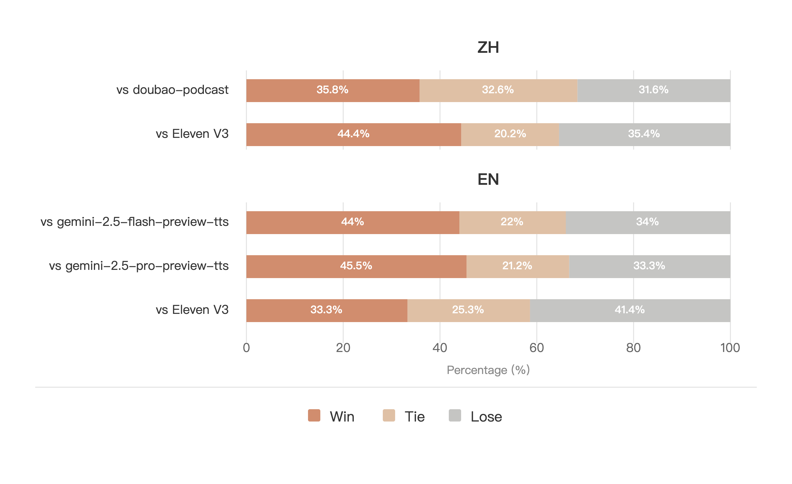

# MOSS-TTSD

**MOSS-TTSD** is a long-form spoken dialogue generation model that enables highly expressive multi-party conversational speech synthesis across multiple languages. It supports continuous long-duration generation, flexible multi-speaker dialogue control, and state-of-the-art zero-shot voice cloning with only short reference audio. MOSS-TTSD is designed for real-world long-form content creation, including podcasts, audiobook, sports and esports commentary, dubbing, crosstalk, and entertainment scenarios.


## 1. Overview

### 1.1 TTS Family Positioning
MOSS-TTSD is the Long-Form Dialogue Specialist in our open-source TTS Family. While our foundational models focus on high-fidelity single-speaker synthesis, MOSS-TTSD extends this capability into the realm of complex, multi-party interactions. It is designed to bridge the gap between distinct audio samples and cohesive, continuous conversation.

**Design Goals**
- **Authentic Interaction**: Capturing the natural rhythm, overlaps, and dynamics of human conversation.
- **Sustained Coherence**: Maintaining speaker identity and contextual consistency over extended durations (up to 1 hour).
- **Production Adaptability**: Serving diverse high-end scenarios from rigorous audiobook narration to dynamic sports commentary.

### 1.2 Key Capabilities
MOSS-TTSD transforms static text into living conversations, offering features specifically optimized for multi-speaker environments:

- **Multi-Party Conversational Generation** — Unlike traditional TTS which optimizes for reading, MOSS-TTSD masters the rhythm of conversation. It supports 1 to 5 speakers with flexible control, handling natural turn-taking, overlapping speech patterns, and distinct persona maintenance.

- **Extreme Long-Context Modeling** — Moving beyond short-sentence generation, the model is architected for stability over long durations, supporting up to 60 minutes of coherent audio in a single session without losing speaker identity or prosodic quality.

- **Diverse Scenario Adaptation** — The model is fine-tuned on high-variability scenarios to handle different speaking styles:
  - Conversational Media: AI Podcasts, Interviews.
  - Dynamic Commentary: High-energy Sports/Esports shouting and analysis.
  - Entertainment: Audiobooks (narrator + characters), Dubbing, and Crosstalk (Xiangsheng).

- **Multilingual & Zero-Shot Cloning** — Features state-of-the-art zero-shot voice cloning requiring only short reference audio (3-10s), with robust cross-lingual performance across major languages including Chinese, English, Japanese, and European languages.

### 1.3 Model Architecture

MOSS-TTSD is built on top of **Delay Pattern (MossTTSDelay)** from our MOSS-TTS foundation model — a single Transformer backbone with multi-head parallel prediction using delay scheduling for multi-codebook audio tokens. 

For full architecture details, see **`moss_tts_delay/README.md`**.

### 1.4 Released Models

| Model | Architecture | NVQ | Parameters |
|-------|-------------|-----|------------|
| MOSS-TTSD | Delay Pattern (MossTTSDelay) | 16 | 8B |

**Recommended decoding hyperparameters**

| Model | audio_temperature | audio_top_p | audio_top_k | audio_repetition_penalty |
|---|---:|---:|---:|---:|
| **MOSS-TTSD** | 1.1 | 0.9 | 50 | 1.1 |

## 2. Quick Start

MOSS-TTSD uses a **continuation** workflow: provide reference audio for each speaker, their transcripts as a prefix, and the dialogue text to generate. The model continues in each speaker's identity.

```python
import os
from pathlib import Path
import torch
import torchaudio
from transformers import AutoModel, AutoProcessor

pretrained_model_name_or_path = "OpenMOSS-Team/MOSS-TTSD"
audio_tokenizer_name_or_path = "OpenMOSS-Team/MOSS-Audio-Tokenizer"
device = "cuda" if torch.cuda.is_available() else "cpu"
dtype = torch.bfloat16 if device == "cuda" else torch.float32

processor = AutoProcessor.from_pretrained(
    pretrained_model_name_or_path,
    trust_remote_code=True,
    codec_path=audio_tokenizer_name_or_path,
)
processor.audio_tokenizer = processor.audio_tokenizer.to(device)
processor.audio_tokenizer.eval()

model = AutoModel.from_pretrained(
    pretrained_model_name_or_path,
    trust_remote_code=True,
    attn_implementation="flash_attention_2",
    torch_dtype=dtype,
).to(device)
model.eval()

# --- Inputs ---

prompt_audio_speaker1 = "https://speech-demo.oss-cn-shanghai.aliyuncs.com/moss_tts_demo/tts_readme_demo/reference_02_s1.wav"
prompt_audio_speaker2 = "https://speech-demo.oss-cn-shanghai.aliyuncs.com/moss_tts_demo/tts_readme_demo/reference_02_s2.wav"
prompt_text_speaker1 = "[S1] In short, we embarked on a mission to make America great again for all Americans."
prompt_text_speaker2 = "[S2] NVIDIA reinvented computing for the first time after 60 years. In fact, Erwin at IBM knows quite well that the computer has largely been the same since the 60s."

text_to_generate = "[S1] Listen, let's talk business. China. I'm hearing things. People are saying they're catching up. Fast. What's the real scoop? Their AI—is it a threat? [S2] Well, the pace of innovation there is extraordinary, honestly. They have the researchers, and they have the drive. [S1] Extraordinary? I don't like that. I want us to be extraordinary. Are they winning? [S2] I wouldn't say winning, but their progress is very promising. They are building massive clusters. They're very determined. [S1] Promising. There it is. I hate that word. When China is promising, it means we're losing. It's a disaster, Jensen. A total disaster. "

# --- Load & resample audio ---

target_sr = int(processor.model_config.sampling_rate)
wav1, sr1 = torchaudio.load(prompt_audio_speaker1)
wav2, sr2 = torchaudio.load(prompt_audio_speaker2)

if wav1.shape[0] > 1:
    wav1 = wav1.mean(dim=0, keepdim=True)
if wav2.shape[0] > 1:
    wav2 = wav2.mean(dim=0, keepdim=True)
if sr1 != target_sr:
    wav1 = torchaudio.functional.resample(wav1, sr1, target_sr)
if sr2 != target_sr:
    wav2 = torchaudio.functional.resample(wav2, sr2, target_sr)

# --- Build conversation ---

reference_audio_codes = processor.encode_audios_from_wav([wav1, wav2], sampling_rate=target_sr)
concat_prompt_wav = torch.cat([wav1, wav2], dim=-1)
prompt_audio = processor.encode_audios_from_wav([concat_prompt_wav], sampling_rate=target_sr)[0]

full_text = f"{prompt_text_speaker1} {prompt_text_speaker2} {text_to_generate}"

conversations = [
    [
        processor.build_user_message(
            text=full_text,
            reference=reference_audio_codes,
        ),
        processor.build_assistant_message(
            audio_codes_list=[prompt_audio]
        ),
    ],
]

# --- Inference ---

batch_size = 1

save_dir = Path("output")
save_dir.mkdir(exist_ok=True, parents=True)
sample_idx = 0
with torch.no_grad():
    for start in range(0, len(conversations), batch_size):
        batch_conversations = conversations[start : start + batch_size]
        batch = processor(batch_conversations, mode="continuation")
        input_ids = batch["input_ids"].to(device)
        attention_mask = batch["attention_mask"].to(device)

        outputs = model.generate(
            input_ids=input_ids,
            attention_mask=attention_mask,
            max_new_tokens=2000,
        )

        for message in processor.decode(outputs):
            for seg_idx, audio in enumerate(message.audio_codes_list):
                torchaudio.save(save_dir / f"{sample_idx}_{seg_idx}.wav", audio.unsqueeze(0), processor.model_config.sampling_rate)
            sample_idx += 1

```

### Input Types

**UserMessage**

| Field | Type | Required | Description |
|---|---|---:|---|
| `text` | `str` | Yes | Full dialogue text including speaker tags (`[S1]`, `[S2]`, ...) and prompt transcripts. |
| `reference` | `List` | Yes | Per-speaker reference audio codes from `processor.encode_audios_from_wav()`. |

**AssistantMessage**

| Field | Type | Required | Description |
|---|---|---:|---|
| `audio_codes_list` | `List` | Yes | Concatenated prompt audio codes for all speakers. |

### Generation Hyperparameters

| Parameter | Type | Default | Description |
|---|---|---:|---|
| `max_new_tokens` | `int` | — | Controls total generated audio tokens. **1s ≈ 12.5 tokens**. |
| `audio_temperature` | `float` | 1.1 | Higher values increase variation; lower values stabilize prosody. |
| `audio_top_p` | `float` | 0.9 | Nucleus sampling cutoff. |
| `audio_top_k` | `int` | 50 | Top-K sampling. |
| `audio_repetition_penalty` | `float` | 1.1 | >1.0 discourages repeating patterns. |


## 3. Evaluation
### Objective Evaluation(TTSD-eval)


We introduce a robust evaluation framework leveraging **MMS-FA** for alignment and **wespeaker** for embedding extraction to ensure precise speaker attribution.


- **Method**: Forced-alignment based segmentation + Similarity-based speaker verification.

- **Metrics**: 
  - **Speaker Attribution Accuracy (ACC)**
  - **Speaker Similarity (SIM)**
  - **Word Error Rate (WER)** computed using **Whisper-large-v3**.

- **Dataset**: 100 multi-turn dialogues (CN/EN) spanning 30s–720s. Covers diverse scenarios including Podcasts, TV dubbing, and Crosstalk. Code and data coming soon.  
<br>

| Model | ZH - SIM | ZH - ACC | ZH - WER | EN - SIM | EN - ACC | EN - WER |
| :--- | :---: | :---: | :---: | :---: | :---: | :---: |
| **Comparison with Open-Source Models** | | | | | | |
| MOSS-TTSD | **0.7949** | **0.9587** | **0.0485** | **0.7326** | **0.9626** | 0.0988 |
| MOSS-TTSD v0.7 | 0.7423 | 0.9391 | 0.0517 | 0.6743 | 0.9266 | 0.1612 |
| Vibevoice 7B | 0.7590 | 0.9222 | 0.0570 | 0.7140 | 0.9554 | **0.0946** |
| Vibevoice 1.5 B | 0.7415 | 0.8798 | 0.0818 | 0.6961 | 0.9353 | 0.1133 |
| FireRedTTS2 | 0.7383 | 0.9022 | 0.0768 | - | - | - |
| Higgs Audio V2 | - | - | - | 0.6860 | 0.9025 | 0.2131 |
| **Comparison with Proprietary Models** | | | | | | |
| Eleven V3 | 0.6970 | 0.9653 | **0.0363** | 0.6730 | 0.9498 | **0.0824** |
| MOSS-TTSD (elevenlabs_voice) | **0.8165** | **0.9736** | 0.0391 | **0.7304** | **0.9565** | 0.1005 |
| | | | | | | |
| gemini-2.5-pro-preview-tts | - | - | - | 0.6786 | 0.9537 | **0.0859** |
| gemini-2.5-flash-preview-tts | - | - | - | 0.7194 | 0.9511 | 0.0871 |
| MOSS-TTSD (gemini_voice) | - | - | - | **0.7893** | **0.9655** | 0.0984 |
| | | | | | | |
| Doubao_Podcast | 0.8034 | 0.9606 | **0.0472** | - | - | - |
| MOSS-TTSD (doubao_voice) | **0.8226** | **0.9630** | 0.0571 | - | - | - |

### Subjective Evaluation
For open-source models, annotators are asked to score each sample pair in terms of speaker attribution accuracy, voice similarity, prosody, and overall quality. Following the methodology of the LMSYS Chatbot Arena, we compute Elo ratings and confidence intervals for each dimension.


For closed-source models, annotators are only asked to choose the overall preferred one in each pair, and we compute the win rate accordingly.
