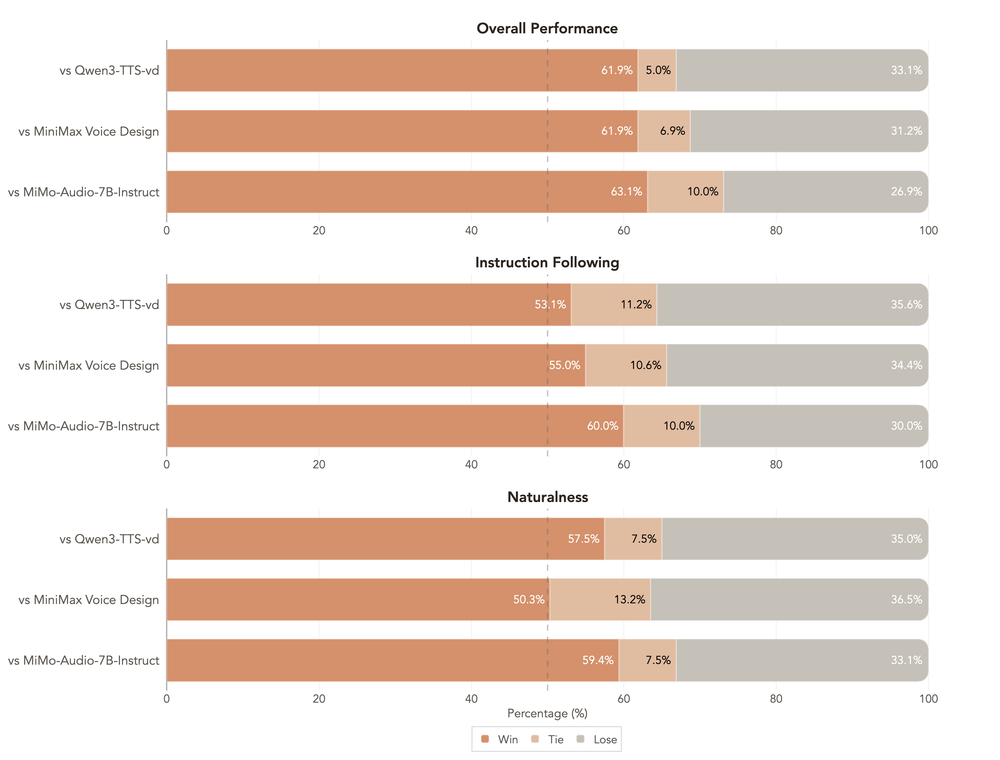

# MOSS-VoiceGenerator Model Card

**MOSS-VoiceGenerator** is an open-source voice generation system designed to enable the creation of custom speaker timbres from free-form textual descriptions. This model allows users to generate voices that reflect specific characters, personalities, and emotions. It is particularly notable for its ability to produce speech with natural-sounding emotional expressiveness, providing a realistic and nuanced listening experience. As an open-source tool, MOSS Voice Generator is suitable for a variety of applications, such as audiobooks, game dubbing, role-playing agents, and conversational assistants.

---

## 1. Overview

### 1.1 TTS Family Positioning

**MOSS-VoiceGenerator** is a high-fidelity voice design tool within the broader TTS Family. It specializes in crafting expressive and natural-sounding voices from textual descriptions. Unlike traditional TTS systems relying on predefined voices or reference audio, MOSS-VoiceGenerator enables zero-shot voice design, allowing for the creation of customized voices for a variety of applications, such as characters, audiobooks, games, or virtual assistants. Additionally, it can serve as a voice design layer for other TTS systems, addressing the challenge of finding suitable reference audio and improving integration and performance.

**Key Capabilities**
* **Highly expressive emotional delivery**: Aimed at generating voices with dynamic and nuanced emotional performances, allowing for natural shifts in tone, pace, and emotion.
* **Human-Like Naturalness** : Indistinguishable from real human speech with authentic breathing, pauses, and vocal nuances
* **Multilingual Support** : High-quality synthesis in Chinese and English

---

### 1.2 Model Architecture
**MOSS-VoiceGenerator** employs MossTTSDelay architecture (see [moss_tts_delay/README.md](../moss_tts_delay/README.md) for more details), where voice description instructions and the text to be synthesized are concatenated and jointly tokenized as input to drive speech generation, enabling unified modeling of timbre design, style control, and content synthesis. Through instruction-timbre alignment, the model learns the correspondence between textual descriptions and acoustic features, allowing it to generate high-fidelity speech with target timbre, emotion, and style directly from free-form text prompts—without requiring any reference audio. 

### 1.3 Released Model
**Recommended decoding hyperparameters**
| Model | audio_temperature | audio_top_p | audio_top_k | audio_repetition_penalty |
|---|---:|---:|---:|---:|
| **MOSS-VoiceGenerator** | 1.5 | 0.6 | 50 | 1.1 |

---

## 2. Quick Start

```python
import os
from pathlib import Path
import torch
import torchaudio
from transformers import AutoModel, AutoProcessor
# Disable the broken cuDNN SDPA backend
torch.backends.cuda.enable_cudnn_sdp(False)
# Keep these enabled as fallbacks
torch.backends.cuda.enable_flash_sdp(True)
torch.backends.cuda.enable_mem_efficient_sdp(True)
torch.backends.cuda.enable_math_sdp(True)

pretrained_model_name_or_path = "OpenMOSS-Team/MOSS-VoiceGenerator"
device = "cuda" if torch.cuda.is_available() else "cpu"
dtype = torch.bfloat16 if device == "cuda" else torch.float32

processor = AutoProcessor.from_pretrained(
    pretrained_model_name_or_path,
    trust_remote_code=True,
    normalize_inputs=True, # normalize text and instruction input
)
processor.audio_tokenizer = processor.audio_tokenizer.to(device)


# ====== Batch demo  ======
text1="哎呀，我的老腰啊，这年纪大了就是不行了。"
instruction1="疲惫沙哑的老年声音缓慢抱怨，带有轻微呻吟。"

text2="亲爱的观众们，今天我要为大家做一道传说中的龙须面，这道面条细如发丝，需要极其精湛的手艺才能制作成功，请大家仔细观看我的每一个动作。"
instruction2="热情的美食节目主持人，语调生动活泼，充满对美食的热爱和专业精神。"

text3="Hey there, stranger! What brings you to our humble town? Looking for a good drink or a tall tale?"
instruction3="Hearty, jovial tavern owner's voice, loud and welcoming with a slightly gruff, friendly tone in American English, radiating warmth and hospitality."

text4="The quick brown fox jumps over the lazy dog."
instruction4="Clear, neutral voice for phonetic practice, even tempo and precise articulation in standard American English, emphasizing clarity of each word."

conversations = [
    [processor.build_user_message(text=text1, instruction=instruction1)],
    [processor.build_user_message(text=text2, instruction=instruction2)],
    [processor.build_user_message(text=text3, instruction=instruction3)],
    [processor.build_user_message(text=text4, instruction=instruction4)],
]

model = AutoModel.from_pretrained(
    pretrained_model_name_or_path,
    trust_remote_code=True,
    # If FlashAttention 2 is installed, you can set attn_implementation="flash_attention_2"
    attn_implementation="sdpa",
    torch_dtype=dtype,
).to(device)
model.eval()

batch_size = 1

messages = []
save_dir = Path("inference_root")
save_dir.mkdir(exist_ok=True, parents=True)
sample_idx = 0
with torch.no_grad():
    for start in range(0, len(conversations), batch_size):
        batch_conversations = conversations[start : start + batch_size]
        batch = processor(batch_conversations, mode="generation")
        input_ids = batch["input_ids"].to(device)
        attention_mask = batch["attention_mask"].to(device)

        outputs = model.generate(
            input_ids=input_ids,
            attention_mask=attention_mask,
        )

        for message in processor.decode(outputs):
            audio = message.audio_codes_list[0]
            out_path = save_dir / f"sample{sample_idx}.wav"
            sample_idx += 1
            torchaudio.save(out_path, audio.unsqueeze(0), processor.model_config.sampling_rate)

```

### Input Types

**UserMessage**

| Field | Type | Required | Description |
|---|---|---:|---|
| `text` | `str` | Yes | Text to synthesize. Supports Chinese and English. |
| `instruction` | `str` | Yes | Specify the style or the synthesized speech. Users can provide detailed speech style instructions, such as emotion, speed, pitch, and voice characteristics. |


### Generation Hyperparameters

| Parameter | Type | Default | Description |
|---|---|---:|---|
| `audio_temperature` | `float` | 1.5 | Higher values increase variation; lower values stabilize prosody. |
| `audio_top_p` | `float` | 0.6 | Nucleus sampling cutoff. Lower values are more conservative. |
| `audio_top_k` | `int` | 50 | Top-K sampling. Lower values tighten sampling space. |
| `audio_repetition_penalty` | `float` | 1.1 | >1.0 discourages repeating patterns. |

> Note: MOSS-VoiceGenerator is **sensitive to decoding hyperparameters**. See **Released Models** for recommended defaults.


---


## 3. Performance

MOSS-VoiceGenerator demonstrates significant advantages in subjective evaluation. Using 160 internal test samples covering diverse voice styles, we established three independent evaluation dimensions: (1) **Overall Preference** - Which voice would you choose? (2) **Instruction Following** - Which audio best follows the instructions (gender, age, tone, emotion, accent, speed)? (3) **Naturalness** - Which audio sounds most like real human speech? Results show that **MOSS-VoiceGenerator outperforms all TTS systems** that support zero predefined voices and customizable preview text across these three dimensions.
